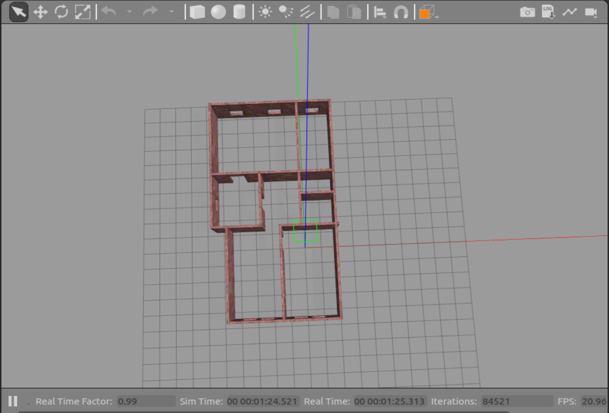
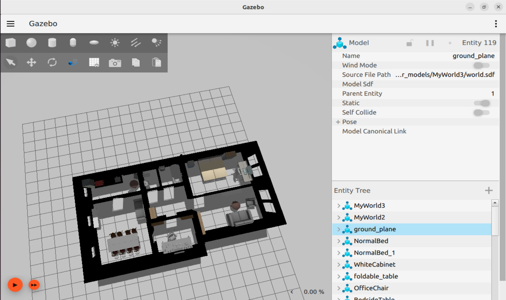
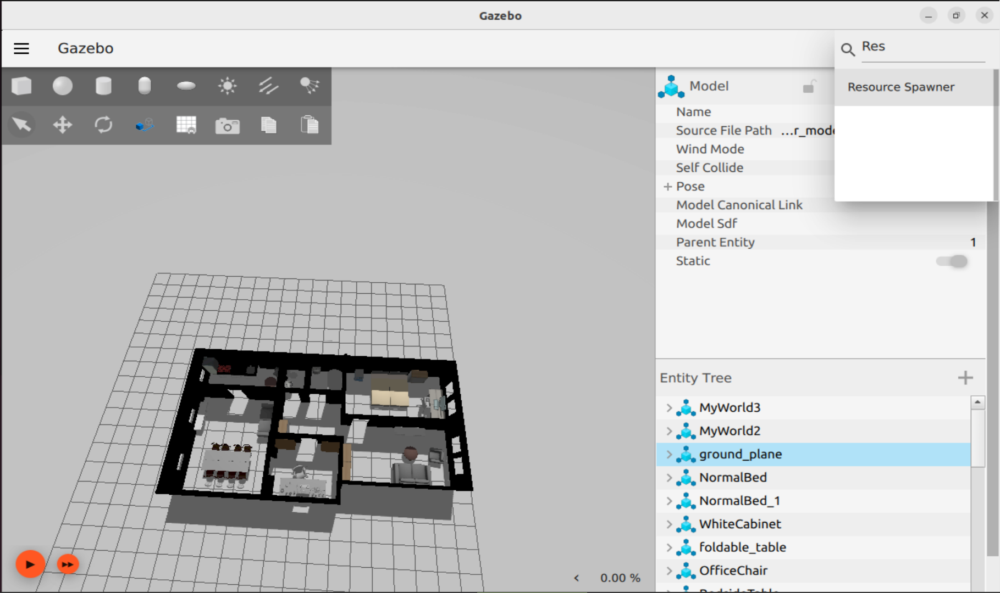
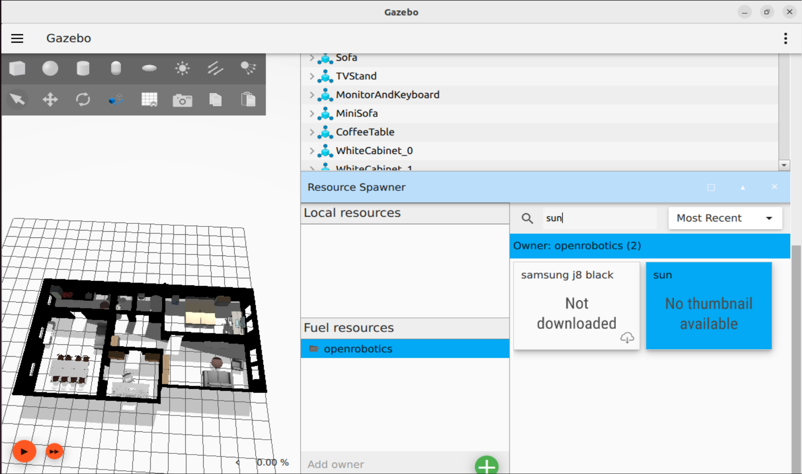
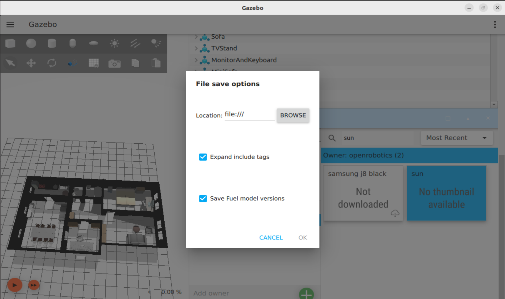

# Создание симуляции TurtleBot4 в Gazebo

## Описание работы

В данной работе мы создадим мир при помощи инструмента Gazebo и проведем в нем симуляцию TurtleBot4.

## Используемая среда

Перед началом необходимо настроить рабочую среду на вашем компьютере. Лично я использовал виртуальную машину Ubuntu 22.04.5 LTS (Jammy Jellyfisf) в VirtualBox, на нее я поставил Ros2-Humble, Gazebo Classic и Gazebo Ignition. 

Я не буду останавливаться на том, как поставить виртуальную машину и установить остальное ПО, потому что тема этого мануала про работу с Gazebo и ROS2, но вы можете воспользоваться ссылками ниже для их установки:

* [Ubuntu 22.04.5 LTS (Jammy Jellyfish)](https://releases.ubuntu.com/jammy/)
* [ROS2-Humble](https://docs.ros.org/en/humble/Installation/Ubuntu-Install-Debs.html)
* [Gazebo Ignition 6.16.0](https://gazebosim.org/api/gazebo/6/install.html)
* [Gazebo 11.10.2](https://classic.gazebosim.org/download)

## Подготовка рабочего пространства ROS2

1. Для корректной работы ROS2 необходимо создать особое рабочее пространство, для ROS2-Humble необходимо будет воспользоваться инструментом colcon,
   чтобы его установить воспользуйтесь следующей командой:
   
   `sudo apt install python3-colcon-common-extensions`

2. Далее необходимо изменить файл ~/.bashrc, чтобы colcon стал доступным после каждого перезапуска терминала.

   `echo 'source /usr/share/colcon_argcomplete/hook/colcon-argcomplete.bash' >> ~/.bashrc`

   перезапускаем терминал и продолжаем работу.

4. Теперь перейдем к созданию рабочего пространства ROS2, создадим директорию, внутри которой будет находиться это рабочее пространство:
   
   `mkdir ~/demo_ws`

5. Также создадим папку, которая будет хранить все пакеты ROS2:

   `mkdir ~/demo_ws/src`

6. Теперь инициализируем рабочее пространство, используя colcon:

   `cd ~/demo_ws`
   
   `colcon build --symlink-install`

   В итоге в директории ~/demo_ws должны находиться папки build, install, log и ранее созданная src.

7. Чтобы мы могли обращаться к пакетам ROS2 отовсюду, изменим файл ~/.bashrc

   `echo 'source ~/demo_ws/install/setup.bash' >> ~/.bashrc`

Теперь наше рабочее пространство готово, вернемся к нему позже.

## Создание модели здания с помощью Building Editor в Gazebo

Если вы уже установили Gazebo Classic, то выполняйте действия ниже, если нет, то перейдите по ссылке для скачивания, которая находится выше.

1. Итак, открываем динамический симулятор Gazebo, введя в терминал:

   `gazebo`

   откроется приложение, как на картинке ниже.


2. Далее либо используя комбинацию клавишь Ctrl+B, либо через меню сверху открываем Building Editor.
   
   Чтобы понять, как пользоваться этим инструментом, вы можете вопользоваться туториалом с официального сайта Gazebo:
   [ССЫЛКА НА ТУТОРИАЛ](https://classic.gazebosim.org/tutorials?tut=building_editor)
   


4. У меня получилось создать следующее здание.



5. Эту модель мы будем использовать при создании нашего мира симуляции. Сохраняем ее и выходим из Gazebo.

## Создание мира симуляции с помощью Ignition Gazebo

1. Открываем папку, в которую сохранили модель здания, у вас должно появиться два файла model.sdf и model.config, теперь нам необходимо создать файл world.sdf, который будет непосредственно файлом нашего мира и прописать в него следующий скрипт, который создаст мир с моделью нашего здания:
   
```
    <?xml version="1.0" ?>
    <sdf version="1.6">
       <world name="default">
          <include>
             <uri>file://{путь до вашего файла model.sdf}</uri>
          </include>
       </world>
    </sdf>
```

2. Теперь открываем созданный мир в Gazebo Ignition:

   `ign gazebo {путь до файла мира}`

Должно запуститься следующее приложение.



3. Как вы могли заметить, в моем здании уже есть элементы декора, в вашем случае оно должно быть пустым. Давайте заполним и ваш мир, для этого нажимаем на три точки в правом верхенм углу и находим Resource Spawner.



4. Изначально в Resource Spawner доступно три пакета с моделями, но нас будет интересовать только один - openrobotics (при желании вы можете установить свои пакеты или отдельные модели, как это сделать можно посмотреть [здесь](https://gazebosim.org/docs/latest/fuel_insert/)). Дожидаемся загрузки всех моделей из пакета - их всего 1073, далее ищем нужные нам и добавляем в наш мир. **Обязательно добавляем в мир солнце и землю, иначе ничего не будет видно и все просто провалится вниз!**



5. После того, как мир готов, сохраняем его используюя SAVE AS и выбирая обе галочки. На этом создание мира завершено, можно закрывать Gazebo Ignition.



